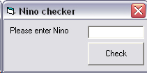



## National Insurance Checker \(NINO\)

### Description

Tells you if a National Insurance Number (NINO) is valid
 
### More Info
 
The national insurance number is passed as a string. The length should be 8 (without a suffix) or 9 (with a suffix)

This uses the current government standard for National Insurance Numbers

True if it is a valid NINO and false if it is invalid

The application will display a message box telling you if the NINO is valid or invalid

             |
---                |---
**Submitted On**   |2007-02-06 10:29:14
**By**             |[Barry Chocolate](https://github.com/Planet-Source-Code/PSCIndex/blob/master/ByAuthor/barry-chocolate.md)
**Level**          |Advanced
**User Rating**    |5.0 (10 globes from 2 users)
**Compatibility**  |VB 3\.0, VB 4\.0 \(16\-bit\), VB 4\.0 \(32\-bit\), VB 5\.0, VB 6\.0, VB Script, VBA MS Access, VBA MS Excel
**Category**       |[Miscellaneous](https://github.com/Planet-Source-Code/PSCIndex/blob/master/ByCategory/miscellaneous__1-1.md)
**World**          |[Visual Basic](https://github.com/Planet-Source-Code/PSCIndex/blob/master/ByWorld/visual-basic.md)
**Archive File**   |[National\_I2047872142007\.zip](https://github.com/Planet-Source-Code/barry-chocolate-national-insurance-checker-nino__1-67802/archive/master.zip)

